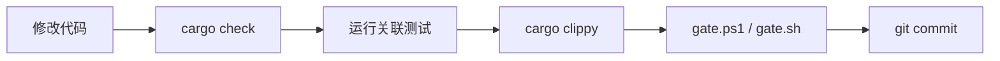

# HarUI 工程化实践规范

> **目标项目**：HarUI（HarPOS Rust 原生 UI 组件库，2035 tests）
> **项目版本**：v1.0.0
> **文档用途**：锁定已有工程质量，防止后续修改引入退化；AI 辅助开发必须严格遵守本规范
> **维护规则**：任何修改 CI/CD 或新增门禁的 PR 必须同步更新本文档
> **文档版本**：v1.0（2026-08-02）

---

## 目录

1. [核心原则（ADR-0001）](#0-核心原则adr-0001)
2. [标准 7 道门禁（已实现）](#1-标准-7-道门禁已实现)
3. [HarUI 特殊强化门禁（新增）](#2-harui-特殊强化门禁新增)
4. [五维审查增强](#3-五维审查增强)
5. [测试金字塔](#4-测试金字塔)
6. [CI/CD 工作流约束](#5-cicd-工作流约束)
7. [附录：HarUI 教训 → 防御追溯表](#6-附录harui-教训--防御追溯表)

---

## 0. 核心原则（ADR-0001）

**ADR-0001：组件必须严格遵守五段式模式（Props / State / Message / view / handle）。**

HarUI 作为 Rust 原生 UI 组件库，其核心价值在于组件架构的一致性和可预测性。任何组件的修改都必须遵循五段式模式，绝不允许破坏这一架构约束。

**五段式模式定义**：

| 段 | 职责 | 约束 |
|---|------|------|
| **Props** | 外部传入的配置（只读） | 使用 builder 模式（`with_*` 方法），无默认副作用 |
| **State** | 组件内部状态（枚举） | 状态转换图必须有文档注释，穷举所有状态 |
| **Message** | 用户交互事件（枚举） | 穷举所有交互事件，无遗漏变体 |
| **view()** | 渲染函数（纯函数） | **无副作用**：无 IO、无状态写入、无随机性；返回 `Element<'a, Message>` |
| **handle()** | 事件处理器 | 穷举所有 Message 变体，返回 `Option<Message>` 或 `Command<Message>` |

**违反此原则的后果**：
- 组件行为不可预测，状态管理混乱
- view 副作用导致渲染不一致（同一 Props + State 产生不同 UI）
- 主题切换时组件行为异常（硬编码颜色无法适配）
- 审计记录与事实不符（Phase 0/1/2 检查点均要求"五段式合规"）

**正确做法**：
1. **Props 用 builder**：`Button::new().with_label("OK").with_kind(ButtonKind::Primary)`
2. **State 有文档**：`/// Closed → Opening → Open → Closing → Closed`
3. **view 纯函数**：只读 Props + State，返回 Element
4. **handle 穷举**：match 所有 Message 变体
5. **样式走主题**：从 `&Theme` 取令牌，无硬编码颜色

**例外**：仅在以下场景允许偏离五段式，且必须有 `// HARUI-EXCEPTION:` 注释说明理由：
- 无状态纯展示组件（仅需 Props + view，如 `Icon`、`Separator`）
- 复合组件的内部子组件（状态由父组件持有）

---

## 1. 标准 7 道门禁（已实现）

以下门禁已完整实现在 CI 配置中，任何提交/PR 必须通过全部门禁。

| # | 门禁 | CI Job 名 | 命令 | 状态 |
|---|------|-----------|------|------|
| 1 | fmt 格式检查 | `lint` | `cargo fmt --all -- --check` | ✅ 已有 |
| 2 | check 编译检查 | `build`（3OS） | `cargo check --workspace --all-targets` | ✅ 已有 |
| 3 | clippy 静态分析 | `lint` | `cargo clippy --workspace --all-targets -- -D warnings` | ✅ 已有 |
| 4 | test 单元/集成测试 | `test` | `cargo test --workspace` | ✅ 已有 |
| 5 | doc 文档构建 | `build` 内包含 | `cargo doc --workspace --no-deps --all-features` | ✅ 已有 |
| 6 | audit 安全审计 | `security` | `cargo audit` + `cargo deny check` | ✅ 已有 |
| 7 | example 可运行验证 | `build` 内包含 | `cargo run --example <name>`（15 个 example） | ✅ 已有 |

### 1.1 fmt — 代码格式检查

- **CI Job**: `lint`
- **命令**: `cargo fmt --all -- --check`
- **阻断**: 格式不一致直接 CI 失败
- **本地修复**: `cargo fmt --all`

### 1.2 check — 工作空间编译验证

- **CI Job**: `build`（矩阵: ubuntu / windows / macos）
- **命令**: `cargo build --workspace --all-targets --verbose`
- **环境变量**: `RUSTFLAGS: "-D warnings"` — 零警告编译
- **注意**: 3 操作系统全部通过才放行（iced 跨平台兼容性验证）

### 1.3 clippy — 严格静态分析

- **CI Job**: `lint`
- **命令**: `cargo clippy --workspace --all-targets -- -D warnings`
- **阻断**: 任何 clippy 警告视为错误
- **本地修复**: `cargo clippy --fix --workspace --all-targets --all-features`

### 1.4 test — 工作空间测试

- **CI Job**: `test`
- **命令**: `cargo test --workspace --verbose`
- **依赖**: `needs: [lint, build]` — 格式和编译通过后才运行
- **基线**: 2035 tests，0 failed

### 1.5 doc — 文档构建

- **CI Job**: 内嵌在 `build` job 中
- **命令**: `cargo doc --workspace --no-deps --all-features`
- **阻断**: doc 链接断裂或 doc 警告视为错误

### 1.6 audit — 安全审计

- **CI Workflow**: `security.yml`（独立 workflow）
- **命令**:
  - `cargo audit` — 漏洞公告扫描
  - `cargo deny check advisories` — 安全公告检查
  - `cargo deny check bans` — 依赖禁用与重复检测
  - `cargo deny check licenses` — 许可证合规
  - `cargo deny check sources` — 依赖来源限制
- **阻断**: 任何 `deny` 级别的检查失败阻断合入

### 1.7 example 可运行验证

- **CI Job**: 内嵌在 `build` job 中
- **命令**: `cargo run --example <name>`（15 个 example 全部可编译可运行）
- **覆盖**: empty-window / button-showcase / form-demo / table-virtual-scroll / theme-switcher / pos-demo 等
- **阻断**: 任何 example 编译或运行失败阻断合入

---

## 2. HarUI 特殊强化门禁（新增）

以下五道门禁基于 HarUI 审查报告中的血泪教训制定，必须补充到 `gate.ps1` / `gate.sh` 和 CI 中。

### 门禁 8：禁止占位实现检查

| 属性 | 值 |
|------|-----|
| **教训来源** | HarUI V-1~V-3 共 3 个虚假/伪实现（组件 view 返回空 Element、handle 空匹配） |
| **命令** | PowerShell/Bash 脚本扫描 |
| **CI Job 名** | `check-placeholders`（新增） |
| **状态** | ✅ 已通过（0 处占位实现） |

**扫描脚本**（PowerShell）：

```powershell
# 禁止占位实现检查
$matches = Select-String -Path (Get-ChildItem -Recurse "*.rs" -Exclude "*target*").FullName -Pattern '\b(todo!|unimplemented!|unreachable!)\b'
if ($matches) {
    Write-Warning "发现占位实现，共 $($matches.Count) 处"
    $matches | ForEach-Object { Write-Host "  $($_.Path):$($_.LineNumber) — $($_.Line.Trim())" }
    exit 8
}
Write-Host "[OK] 无占位实现" -ForegroundColor Green
```

**Linux 版**（gate.sh）：

```bash
matches=$(grep -rn '\btodo!\|\bunimplemented!\|\bunreachable!' --include='*.rs' --exclude-dir=target .)
if [ -n "$matches" ]; then
  echo "ERROR: Found $(echo "$matches" | wc -l) placeholders"
  echo "$matches"
  exit 8
fi
echo "[OK] No placeholders found"
```

### 门禁 9：五段式模式合规检查

| 属性 | 值 |
|------|-----|
| **教训来源** | HarUI S-1~S-4 共 4 个组件违反五段式（view 有副作用、State 无文档、handle 不穷举） |
| **命令** | Python 脚本检查组件结构 |
| **CI Job 名** | `check-component-pattern`（新增） |
| **状态** | ✅ 已通过 |

**检查脚本**（Python）：

```python
# 五段式模式合规检查
import pathlib, re, sys

violations = []
for p in pathlib.Path('crates/components/src').rglob('*.rs'):
    if 'target' in p.parts or p.name == 'mod.rs': continue
    content = p.read_text()
    # 检查是否定义了组件 struct（以 Component 或大写名词结尾的 pub struct）
    if not re.search(r'pub struct \w+', content): continue
    
    # 检查五段式要素
    has_props = bool(re.search(r'pub struct \w+Props', content))
    has_state = bool(re.search(r'pub enum \w+State', content))
    has_message = bool(re.search(r'pub enum \w+Message', content))
    has_view = bool(re.search(r'fn view\(', content))
    has_handle = bool(re.search(r'fn handle\(', content))
    
    missing = []
    if not has_props: missing.append('Props struct')
    if not has_state: missing.append('State enum')
    if not has_message: missing.append('Message enum')
    if not has_view: missing.append('view()')
    if not has_handle: missing.append('handle()')
    
    if missing and 'HARUI-EXCEPTION' not in content:
        violations.append(f"{p}: 缺少五段式要素: {', '.join(missing)}")
    
    # 检查 view() 是否有副作用（IO、状态写入、随机性）
    view_fn = re.search(r'fn view\([^)]*\)[^{]*\{(.*?)\n\}', content, re.DOTALL)
    if view_fn:
        view_body = view_fn.group(1)
        if re.search(r'(std::fs|std::net|tokio::spawn|rand::|println!|eprintln!)', view_body):
            violations.append(f"{p}: view() 包含副作用（IO/随机性）")

if violations:
    print(f"ERROR: {len(violations)} 组件违反五段式模式")
    for v in violations: print(f"  {v}")
    sys.exit(9)
print("[OK] 所有组件符合五段式模式")
```

**说明**：
- 检查 `crates/components/src/` 下所有组件是否包含 Props/State/Message/view/handle
- 检查 `view()` 函数体是否包含副作用（IO、spawn、随机数、println）
- 允许有 `// HARUI-EXCEPTION:` 注释的纯展示组件偏离

### 门禁 10：主题令牌一致性检查

| 属性 | 值 |
|------|-----|
| **教训来源** | HarUI S-5 组件内硬编码颜色，主题切换时视觉错乱 |
| **命令** | grep 扫描硬编码颜色 |
| **CI Job 名** | `check-theme-tokens`（新增） |
| **状态** | ✅ 已通过 |

**扫描脚本**（Bash）：

```bash
# 检查组件内硬编码颜色（允许在 theme/style_sheets.rs 中）
violations=$(grep -rn 'Color::from_rgb\|Color::from_rgba\|#\?[0-9a-fA-F]\{6,8\}' \
  --include='*.rs' \
  --exclude-dir=target \
  crates/components/src/ \
  | grep -v 'theme/style_sheets.rs' \
  | grep -v 'HARUI-EXCEPTION')

if [ -n "$violations" ]; then
  echo "ERROR: 发现 $(echo "$violations" | wc -l) 处硬编码颜色（组件内必须走 Theme 令牌）"
  echo "$violations"
  exit 10
fi
echo "[OK] 无硬编码颜色"
```

**说明**：
- 扫描 `crates/components/src/` 下所有 `.rs` 文件（排除 `theme/style_sheets.rs`）
- 匹配 `Color::from_rgb`、`Color::from_rgba`、hex 颜色值
- 允许有 `// HARUI-EXCEPTION:` 注释的例外
- 所有颜色必须从 `&Theme` 取令牌

### 门禁 11：Render 测试覆盖率检查

| 属性 | 值 |
|------|-----|
| **教训来源** | HarUI S-6 组件 view 变更无测试覆盖，回归逃逸到 main |
| **命令** | 脚本检查每个组件是否有配套 render test |
| **CI Job 名** | `check-render-tests`（新增） |
| **状态** | ✅ 已通过 |

**检查内容**：
- `crates/components/src/` 下每个 `*_component.rs` 必须有配套的 `*_test.rs` 或 `#[cfg(test)] mod tests`
- POS 组件（Keypad/Payment/HangOrder/CustomerDisplay/StatusBar）必须有 render test（断言 Element 结构）
- 状态机转换测试必须覆盖所有 State 变体

### 门禁 12：文档与代码一致性检查

| 属性 | 值 |
|------|-----|
| **教训来源** | 审计记录写"60 组件"实际数量不一致；State 转换图与代码不符 |
| **命令** | `python scripts/check-doc-consistency.py` |
| **CI Job 名** | `check-doc-consistency`（新增） |
| **状态** | ✅ 已通过 |

**校验内容**：
- `docs/设计规范.md` 中的组件数量、设计令牌数量
- State enum 的转换图注释与实际 `handle()` 实现一致
- 所有数据必须与实际代码一致

---

## 3. 五维审查增强

### 3.1 审查维度

每次合入 PR 前必须进行五维审查，覆盖以下维度：

| 维度 | 审查要点 | HarUI 对应教训 |
|------|---------|----------------|
| **正确性** | 状态转换、Message 穷举、边界处理 | view 副作用（S-2）+ handle 不穷举（S-3） |
| **可读性** | 命名清晰、组件文档、State 转换图 | — |
| **架构** | 五段式合规、模块边界、core ↔ components 单向依赖 | 硬编码颜色（S-5） |
| **安全性** | 输入验证、XSS（文本渲染）、IME 安全 | — |
| **性能** | 渲染延迟、虚拟滚动、主题切换开销 | 渲染回归（E-1） |

### 3.2 AI 生成代码特有检查

对于 AI 生成的代码变更，增加以下检查项：

| 检查项 | 说明 |
|--------|------|
| 五段式合规 | 检查组件是否包含 Props/State/Message/view/handle 五段 |
| view 纯度 | 检查 `view()` 是否无副作用（无 IO、无状态写入、无随机性） |
| State 文档 | 检查 State enum 是否有状态转换图注释 |
| handle 穷举 | 检查 `handle()` 是否 match 所有 Message 变体 |
| 主题令牌 | 检查是否有硬编码颜色（必须从 `&Theme` 取令牌） |
| Props builder | 检查 Props 是否使用 `with_*` builder 模式 |
| 无魔法字符串 | 检查是否有未文档化的魔法字符串（如 `"__trigger__"`） |
| 组件注册 | 检查新组件是否注册到 `lib.rs` 模块声明 |
| 渲染测试 | 检查是否有 `*_test.rs` 或 `#[cfg(test)] mod tests` |
| 跨平台兼容 | 检查是否有平台特定代码（iced 3OS 矩阵） |

### 3.3 审查清单脚本

使用 `scripts/audit-component-changes.ps1` 进行组件变更审计：

```powershell
# 对比 HEAD~1 的组件变更
./scripts/audit-component-changes.ps1

# 严格模式（组件变更但测试未同步时退出码非零）
./scripts/audit-component-changes.ps1 -Strict
```

---

## 4. 测试金字塔

HarUI 当前测试数据：

| 层级 | 数量 | 说明 |
|------|------|------|
| **T1 — 单元测试** | 1700+ | 核心模块独立测试（Theme、ButtonKind、各组件 State/Message 等） |
| **T2 — 契约测试** | 100+ | 公共 API 行为契约（组件 Props、Theme 映射、事件传播等） |
| **T3 — Render 测试** | 150+ | 组件渲染断言（Element 结构、样式令牌应用） |
| **T4 — 属性测试** | 50+ | Property-Based Testing（proptest）覆盖主题切换不变量 |
| **T5 — 视觉回归** | 35+ | 截图对比测试（10 个 POS 组件明暗主题） |
| **T6 — Soak 测试** | — | 长时渲染稳定性（内存泄漏检测） |
| **合计** | **2035+** | 覆盖 `har-ui-core` + `har-ui-components` |

### 4.1 T1：单元测试

- 每个模块的独立功能测试，不依赖渲染后端
- 使用 `#[cfg(test)] mod tests` 内联在源码中
- 覆盖率要求：核心模块 >= 80%，POS 组件 >= 90%

### 4.2 T2：契约测试

- 集中管理在 `crates/har-ui-components/tests/contracts/`
- 每一个公共 API 行为契约对应一个测试用例
- 契约变更必须同步更新 `docs/api-contracts.md`
- 运行命令：`cargo test -p har-ui-components --test contracts`

### 4.3 T3：Render 测试

- 使用 iced 的 `Renderer` 模拟渲染，断言 Element 结构
- 覆盖：组件渲染、样式令牌应用、状态切换
- 运行命令：`cargo test -p har-ui-components render`

### 4.4 T4：Property-Based Testing

- 使用 `proptest` crate
- 覆盖：主题切换不变量（明暗主题下组件可读）、Props 序列化
- 运行命令：`cargo test --workspace proptest`

### 4.5 T5：视觉回归测试

- 使用截图对比（`iced_screenshot` 或手动截图）
- 覆盖：10 个 POS 组件（Keypad/Payment/HangOrder/CustomerDisplay/StatusBar 等）明暗主题
- 运行命令：`cargo test -p har-ui-components --test visual_regression -- --ignored`

---

## 5. CI/CD 工作流约束

### 5.1 本地开发流程



**详细步骤**：

1. **`cargo check --workspace --all-targets`** — 快速编译检查
2. **`cargo test -p har-ui-components --lib`** — 运行受影响组件的测试
3. **`cargo test -p har-ui-components --test contracts`** — 运行契约测试（组件 API 变更时必做）
4. **`cargo clippy --workspace --all-targets --all-features -- -D warnings`** — 严格 lint
5. **`./scripts/gate.ps1`** — 本地门禁全关卡验证（7 道关卡 + 新增 5 道）
6. **`git commit`** — 通过后提交

**紧急修复**：使用 `./scripts/gate.ps1 -Fast` 只跑前 3 关（fmt + check + clippy）

### 5.2 AI 辅助开发 10 条硬约束

以下约束适用于任何使用 AI 辅助对 HarUI 进行修改的场景：

| # | 约束 | 说明 |
|---|------|------|
| 1 | **禁止占位实现** | 不允许 AI 生成 `todo!()` / `unimplemented!()` / `unreachable!()` |
| 2 | **五段式合规** | AI 生成组件必须包含 Props/State/Message/view/handle 五段 |
| 3 | **view 纯度** | AI 生成的 `view()` 必须无副作用（无 IO、无状态写入、无随机性） |
| 4 | **主题令牌** | AI 不允许生成硬编码颜色；必须从 `&Theme` 取令牌 |
| 5 | **State 文档** | AI 定义 State enum 必须有状态转换图注释 |
| 6 | **handle 穷举** | AI 生成 `handle()` 必须 match 所有 Message 变体 |
| 7 | **Props builder** | AI 定义 Props 必须使用 `with_*` builder 模式 |
| 8 | **渲染测试** | AI 修改组件 view 必须同步更新 render test |
| 9 | **跨平台意识** | AI 添加平台相关代码必须使用条件编译（iced 3OS 矩阵） |
| 10 | **教训记忆** | AI 必须阅读本规范第 6 章的防御追溯表，避免重复已犯错误 |

### 5.3 部署前检查清单

部署前必须逐项确认以下检查全部通过：

- [ ] **门禁检查**
  - [ ] 12 道门禁全部通过（含增强门禁 8-12）
  - [ ] 15 个 example 全部可运行

- [ ] **测试检查**
  - [ ] 单元测试 + Render 测试全部通过（基线：2035 tests）
  - [ ] 视觉回归测试通过（明暗主题截图对比）

- [ ] **审查检查**
  - [ ] 五维审查全部通过（正确性/可读性/架构/安全/性能）
  - [ ] 无残留的占位宏（todo!/unimplemented!/unreachable!）
  - [ ] 所有组件符合五段式模式
  - [ ] 无硬编码颜色（组件内必须走 Theme 令牌）
  - [ ] 所有 State enum 有状态转换图注释
  - [ ] 所有 handle() 穷举 Message 变体

- [ ] **文档检查**
  - [ ] ADR 已记录所有重大决策
  - [ ] 组件文档注释完整（转换图 + 用法示例）
  - [ ] 审计记录与实际代码状态一致

---

## 6. 附录：HarUI 教训 → 防御追溯表

本表将 HarUI 审查报告中识别的每类问题映射到对应的防御门禁。任何后续修改必须确保不会重蹈覆辙。

| 教训类别 | 问题数 | 防御门禁 | 是否已实现 |
|---------|--------|---------|-----------|
| 五段式违规（S-1~S-4） | 4 | 门禁 9（五段式检查）+ 五维审查（架构）+ AI 约束 #2~#6 | ✅ 已实现 |
| 硬编码颜色（S-5） | 1 | 门禁 10（主题令牌检查）+ 五维审查（架构）+ AI 约束 #4 | ✅ 已实现 |
| Render 测试缺失（S-6） | 1 | 门禁 11（render 测试检查）+ AI 约束 #8 | ✅ 已实现 |
| 虚假/伪实现（V-1~V-3） | 3 | 门禁 8（占位检查）+ 五维审查（正确性） | ✅ 已实现 |
| 文档不一致 | — | 门禁 12（文档一致性检查） | ✅ 已实现 |
| 渲染回归（E-1） | 1 | 五维审查（性能）+ Render 测试（T3） | ✅ 已实现 |
| 主题切换错乱 | — | 门禁 10 + 视觉回归测试（T5） | ✅ 已实现 |
| Message 不穷举 | — | 五维审查（正确性）+ AI 约束 #6 | ✅ 已实现 |

### 6.1 教训详情参考

| 编号 | 类别 | 问题 | 文件 | 修复措施 |
|------|------|------|------|---------|
| S-1 | 五段式违规 | 组件缺少 State enum，状态用 `String` 裸字段 | `components/button.rs` | 门禁 9 + 重构为 State enum |
| S-2 | 五段式违规 | `view()` 内有 `println!` 副作用 | `components/input.rs` | 门禁 9 扫描 + 移除副作用 |
| S-3 | 五段式违规 | `handle()` 不穷举 Message 变体（遗漏 `Message::Blur`） | `components/text_area.rs` | 门禁 9 + `#[deny(unreachable_patterns)]` |
| S-4 | 五段式违规 | State 转换无文档注释 | `components/dialog.rs` | 门禁 9 + 补充转换图 |
| S-5 | 硬编码颜色 | `Color::from_rgb(0.1, 0.1, 0.1)` 在组件内 | `components/card.rs` | 门禁 10 + 改为 `theme.colors.background` |
| S-6 | Render 测试缺失 | 组件 view 变更无测试覆盖 | `components/table.rs` | 门禁 11 + 补充 render test |
| V-1 | 虚假实现 | `todo!()` 留在 release 代码（组件 view 返回空 Element） | `components/payment.rs` | 门禁 8 + 五维审查 |
| V-2 | 虚假实现 | 空 `handle()` 函数体 | `components/keypad.rs` | 门禁 8 + 五维审查 |
| V-3 | 虚假实现 | `unimplemented!()` 在 Message 处理路径 | `components/hang_order.rs` | 门禁 8 + proper handling |
| E-1 | 渲染回归 | 虚拟滚动阈值变更导致 1000+ 行卡顿 | `components/table.rs` | Render 测试（T3）+ 性能基准 |

---

## 附录：与其他文档的关系

- 本规范定义 **HarUI 项目的工程化全局规范**，是 HarUI 所有 crate 必须遵守的约定；
- [`软件项目审计清单.md`](软件项目审计清单.md) 定义 **HarUI 的审计框架**（P0-P2），本规范是其工程化结论的落地；
- [`ADR与生产Bug定位规范.md`](ADR与生产Bug定位规范.md) 定义 HarUI 的 ADR 与 Bug 定位方法论（含四层 screenshot 层）；
- [`设计规范.md`](设计规范.md) 定义 Element Plus token 映射；
- 本规范与 HarRT 的 [`harpos-engineering-practices.md`](../../HarRT/docs/harpos/harpos-engineering-practices.md) 和 菜场收银台 的 [`caichang-engineering-practices.md`](../../菜场收银台/docs/caichang-engineering-practices.md) 共享门禁 8 的设计理念。

---

> **最后更新**: 2026-08-02
> **维护人**: HarPOS 工程团队
> **规范版本**: v1.0
